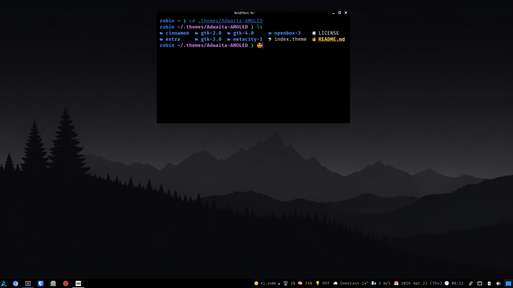

<p align="center">
  
</p>
<h1 align="center">Adwaita AMOLED</h1>
<p align="center">
A true black, AMOLED-optimized take on the classic Adwaita design.
</p>
<p align="center">


</p>

---

<p align="center">
  
</p>

---

## Features

- True AMOLED base (`#000000`) with layered depth
- Clear visual hierarchy across all widget states, unfocused, hover, active
- Correct GTK3 widget rendering: checkboxes show ✓, radio buttons show ●, indeterminate states work
- Refined XFCE panel with accent underline focus indicator, no flat white blocks
- Complete GTK2 theme via the murrine engine, fully styled across all widget classes
- GTK4 + libadwaita color overrides included
- Cinnamon shell theme, Openbox theme, and Metacity window decorations included
- Qt5ct and Qt6ct color schemes with palette matched 1:1 to the GTK tokens

---

## Installation

```bash
# Clone the repo
git clone https://github.com/librerob/Adwaita-AMOLED.git ~/.themes/Adwaita-AMOLED
```

Then set the theme through your desktop's appearance settings, or via the terminal:

```bash
# GTK (XFCE / Cinnamon / GNOME)
gsettings set org.gnome.desktop.interface gtk-theme "Adwaita-AMOLED"
```

```bash
# If you use flatpak apps, run:
sudo flatpak override --filesystem=xdg-config/gtk-3.0 && sudo flatpak override --filesystem=xdg-config/gtk-4.0
```

> **Firefox users:** Open `about:config` and set `widget.gtk.libadwaita-colors.enabled` to `false`.

---

## GTK4 & libadwaita

libadwaita apps ignore GTK themes by default. To apply the overrides:

```bash
mkdir -p ~/.config/gtk-4.0
cp ~/.themes/Adwaita-AMOLED/extra/libadwaita/gtk.css ~/.config/gtk-4.0/gtk.css
cp ~/.themes/Adwaita-AMOLED/extra/libadwaita/gtk-dark.css ~/.config/gtk-4.0/gtk-dark.css
cp ~/.themes/Adwaita-AMOLED/extra/libadwaita/assets ~/.config/gtk-4.0/assets
cp ~/.themes/Adwaita-AMOLED/extra/libadwaita/libadwaita-tweaks.css ~/.config/gtk-4.0/libadwaita-tweaks.css

```

---

## Qt (qt5ct / qt6ct)

```bash
# Qt5
mkdir -p ~/.config/qt5ct/colors
cp ~/.themes/Adwaita-AMOLED/extra/qt5ct/colors/Adwaita-AMOLED.conf ~/.config/qt5ct/colors/

# Qt6
mkdir -p ~/.config/qt6ct/colors
cp ~/.themes/Adwaita-AMOLED/extra/qt6ct/colors/Adwaita-AMOLED.conf ~/.config/qt6ct/colors/
```

Then open `qt5ct` / `qt6ct`, go to **Appearance → Color scheme**, and select **Adwaita-AMOLED**.

---

## Extras

Additional themes are included in the `extra/` folder:

| Extra | Description | How to apply |
|---|---|---|
| **Alacritty** | Terminal color scheme aligned with the palette | Import or merge the provided YAML into your `alacritty.toml` |
| **Kitty** | Terminal color scheme | Include the `.conf` file in your `kitty.conf` |
| **Neovim** | Colorscheme and airline theme | See [Neovim setup](#neovim) below |
| **Qt5ct / Qt6ct** | Full color schemes | See [Qt setup](#qt-qt5ct--qt6ct) above |
| **Rofi** | Matching launcher theme | Pass the theme with `-theme` or set it in your config |
| **Zsh** | Autosuggestions & syntax highlighting config | Integrate the provided lines into your `.zshrc` |

All extras follow the same AMOLED palette and accent system as the GTK theme.

### Neovim

```bash
mkdir -p ~/.config/nvim/colors
cp ~/.themes/Adwaita-AMOLED/extra/nvim/colors/adwaita-amoled.vim ~/.config/nvim/colors/
```

Then add to your config:

```vim
" init.vim
colorscheme adwaita-amoled
```

```lua
-- init.lua
vim.cmd('colorscheme adwaita-amoled')
```

If you use vim-airline, copy the airline theme as well:

```bash
mkdir -p ~/.config/nvim/autoload/airline/themes
cp ~/.themes/Adwaita-AMOLED/extra/nvim/autoload/airline/themes/adwaita-amoled.vim ~/.config/nvim/autoload/airline/themes/
```

```vim
let g:airline_theme = 'adwaita-amoled'
```

---

## Wallpaper

A matching wallpaper is included at `extra/wallpaper/blackmount.png`.

---

## Color Palette

| Token | Hex | Role |
|---|---|---|
| Background | `#000000` | Window base, AMOLED black |
| Surface 1 | `#0f0f0f` | Cards, lists |
| Surface 2 | `#141414` | Popovers, tooltips |
| Hover | `#1a1a1a` | Hover state |
| Border | `#2a2a2a` | Widget borders |
| Accent | `#387af2` | Focus, selection, links |
| Foreground | `#ffffff` | Primary text |
| Dim | `#888888` | Secondary / inactive text |

---

## Structure

```
Adwaita-AMOLED/
├── cinnamon/               Cinnamon shell theme
├── gtk-2.0/                GTK2 theme (murrine engine)
├── gtk-3.0/                GTK3 theme
├── gtk-4.0/                GTK4 theme
├── metacity-1/             Metacity / Muffin window decorations
├── openbox-3/              Openbox window manager theme
├── extra/
│   ├── alacritty/          Alacritty terminal theme
│   ├── kitty/              Kitty terminal theme
│   ├── libadwaita/         gtk.css + gtk-dark.css → copy to ~/.config/gtk-4.0/
│   ├── logo/               Theme logo
│   ├── nvim/               Neovim colorscheme and airline theme
│   ├── qt5ct/              Qt5 color scheme
│   ├── qt6ct/              Qt6 color scheme
│   ├── rofi/               Rofi launcher theme
│   ├── screenshot/         Preview image
│   ├── wallpaper/          Matching wallpaper
│   └── zsh/                Zsh autosuggestions & syntax highlighting config
└── index.theme
```

---

## Philosophy

Minimal, readable, and actually usable.
No washed-out grays, no invisible states.
