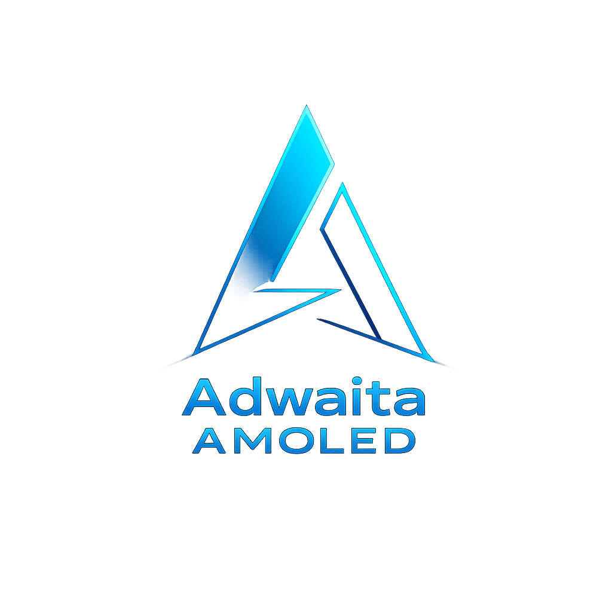

<p align="center">
  
</p>

<h1 align="center">Adwaita AMOLED</h1>

<p align="center">
A true black, AMOLED-optimized take on the classic Adwaita design.
</p>

<p align="center">


</p>


---


# Adwaita AMOLED

A clean, modern AMOLED variant of Adwaita, rebuilt for consistency, clarity, and full-stack GTK support.

## Features

* True AMOLED base (`#000000`) with layered depth
* Clear visual hierarchy (unfocused, hover, active states)
* Fixed and restored GTK3 widget rendering

  * Proper checkboxes (✓)
  * Correct radio buttons (●)
  * Fully working indeterminate states
* Refined XFCE panel styling (no more flat white blocks)
* GTK4 + libadwaita color overrides included
* Complete GTK2 theme (murrine-based, fully styled)
* Cinnamon and Openbox support included
* Metacity window decorations added


## GTK4 / libadwaita Support

For consistent styling in modern apps:

```bash
mkdir -p ~/.config/gtk-4.0/
cp ~/.themes/Adwaita-AMOLED/extra/libadwaita/ ~/.config/gtk-4.0/
```

## Notes

* GTK3, GTK4, and GTK2 are all supported
* Designed for XFCE but works across other desktops
* libadwaita apps are partially themeable due to upstream limitations

## Philosophy

Minimal, readable, and actually usable.

No washed-out grays, no invisible states, no UI guesswork.
